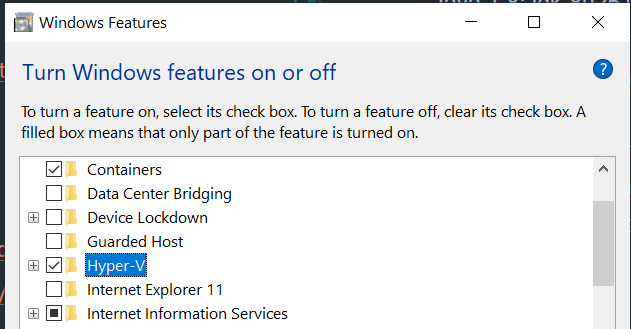
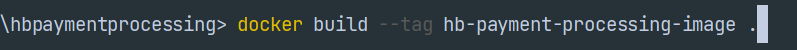
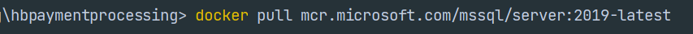
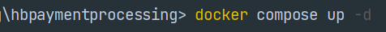
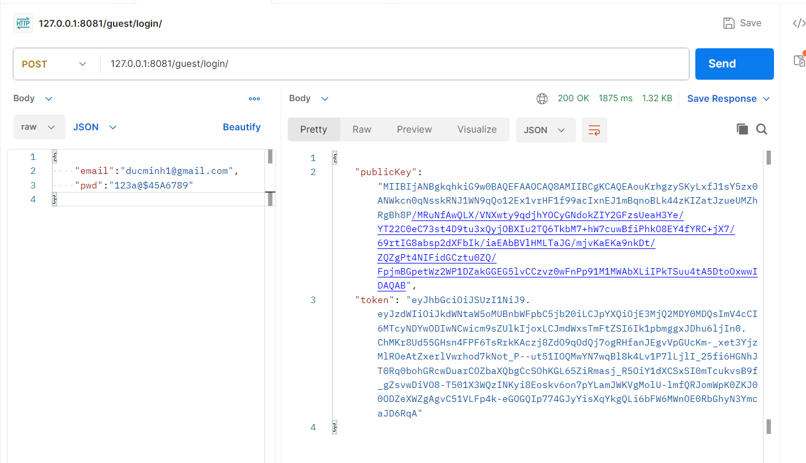
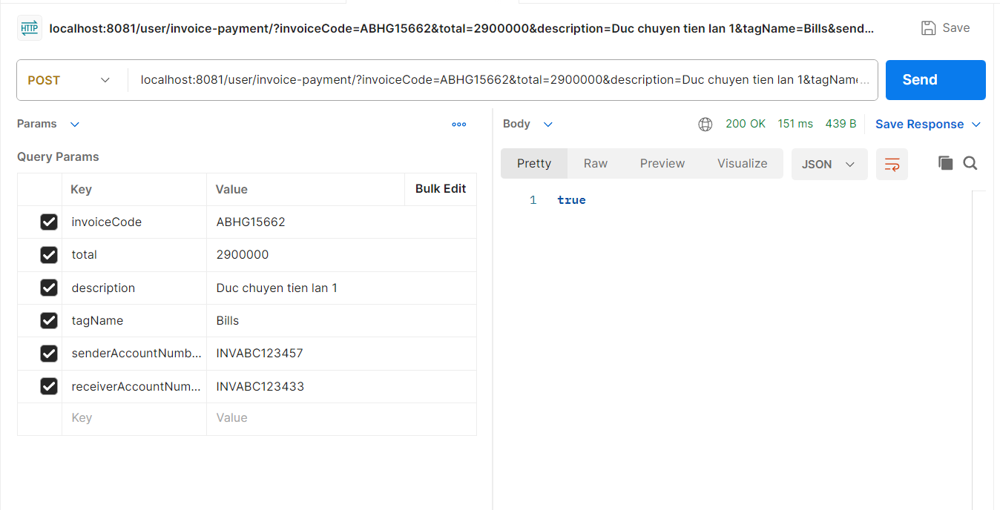

Hướng dẫn cấu hình. 

1. Thông tin phần mềm được sử dụng backend: 
   _ Java 1.8: jdk-8u251-windows-x64  
   _ Database: SQL Server 2019  
   _ Docker: https://www.docker.com/products/docker-desktop/  
   _ Postman: https://www.postman.com/downloads/  

2. Cài đặt và cấu hình:  
   2.1 Docker:  
   _ Cài đặt: https://docs.docker.com/desktop/install/windows-install/  
   _ Cấu hình: https://docs.docker.com/desktop/wsl/  
   _ Nhập "Turn Windows features on or off" vào ô Search trong Windows  
   _ Chọn vào ô Container và Hyper-V  
     
3. Host backend lên Docker  
   _ Tạo image cho backend: "docker build --tag hb-payment-processing-image ." 
     
   _ Kéo image của SQL Server 2019 đã có sẵn về máy: "docker pull mcr.microsoft.com/mssql/server:2019-latest"  
     
   _ Sử dụng docker compose để tạo 1 container cho backend và 1 container cho MS SQL Server 2019  
   "docker compose up -d"  
     
4. Remote vào container của SQL Server 2019 để tạo database cho website  
   _ Mở cmd, và gõ "ipconfig /all"  
   _ Tìm đến dòng "IPv4 Address" bên trong mục "Ethernet adapter vEthernet (WSL):"  
   _ Mở Microsoft SQL Server Management Studio  
   _ nhập địa chỉ IP vừa tìm được cùng với port của database trong file "compose.yaml" vào ô "Server name" theo format "
   xxx.xx.xxx.x,port"  
   _ Nhập tên và mật khẩu đăng nhập được ghi sẵn trong file "application.properties"  
   _ Sử dụng và chạy script có đuôi ".sql" có sẵn trong repository để tạo database  
5. Sử dụng Postman:  
   5.1. Chức năng đăng nhập:  
   _ Sử dụng ip và port đã cấu hình sẵn trong file "compose.yaml"  
   _  "127.0.0.1:8081/guest/login/" và đặt {"email":"ducminh1@gmail.com", "pwd":"123a@$45A6789"} trong mục "Body" -> "
   Raw" -> "JSON" 
     
   5.2. Chức năng thanh toán:  
   _ Sử dụng token trong được trả về sau khi đăng nhập và nhập vào mục "Authorization" -> "Bearer token" type  
   _ Sử dụng ip và port đã cấu hình sẵn trong file "compose.yaml"  
   _ "127.0.0.1:8081/user/invoice-payment/" và đặt các giá trị nào vào mục "Params" -> "Query Params"  
   _ "invoiceCode": "ABHG15662", "total": "2900000", "description": "Duc chuyen tien lan 1", "tagName": "Bills", "
   senderAccountNumberCode": "INVABC123457", "receiverAccountNumberCode":"INVABC123433"  
   _ "senderAccountNumberCode" và "tagName" được giả lập trong database   
   
    
    
    
    
    
   